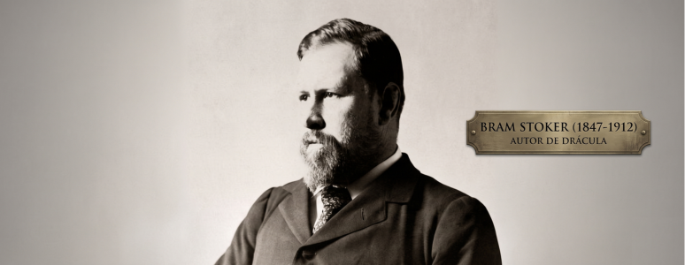

## Quem foi Bram Stoker em 30 segundos

*Bram Stoker* foi um escritor irlandês que transformou o folclore dos vampiros em um dos maiores ícones da cultura ocidental. Embora tenha escrito mais de dez romances, tornou-se eternamente associado a Drácula (1897), obra que definiu grande parte da imagem moderna do vampiro: um aristocrata sombrio, sedutor e ameaçador. Além da carreira literária, trabalhou durante quase trinta anos como empresário do famoso ator Henry Irving no Teatro Lyceum, em Londres. Sua influência alcança a literatura, o cinema, os quadrinhos e praticamente toda a cultura pop contemporânea.

## Linha do tempo

- **8 de novembro de 1847** – Nasce em Dublin, Irlanda.
- **1864** – Ingressa no Trinity College Dublin.
- **1870** – Forma-se em Matemática com honras pelo Trinity College Dublin.
- **1872** – Publica The Duties of Clerks of Petty Sessions in Ireland, sua primeira obra.
- **10 de dezembro de 1876** – Conhece pessoalmente Henry Irving após publicar uma crítica elogiosa de sua atuação em Hamlet.
- **4 de dezembro de 1878** – Casa-se com Florence Balcombe, em Londres.
- **1878** – Muda-se para Londres e torna-se gerente do Teatro Lyceum.
- **31 de dezembro de 1879** – Nasce seu único filho, Irving Noel Thornley Stoker.
- **1890** – Inicia as pesquisas que dariam origem ao romance Drácula.
- **26 de maio de 1897** – Publicação de Drácula.
- **13 de outubro de 1905** – Morre Henry Irving, amigo e mentor de Stoker.
- **1906** – Publica Personal Reminiscences of Henry Irving.
- **20 de abril de 1912** – Morre em Londres, aos 64 anos.
- **23 de abril de 1912** – Seu corpo é cremado no Golders Green Crematorium, em Londres.

---

## Biografia
### 1847–1864 | Infância e juventude

Abraham Stoker nasceu em Dublin em uma família de classe média protestante. Durante os primeiros anos de vida, sofreu uma doença desconhecida que o deixou acamado por longos períodos. O próprio autor mais tarde afirmou que sua mãe lhe contava histórias folclóricas e narrativas sobre epidemias e mortes, elementos que possivelmente influenciaram sua imaginação literária.

Contra todas as expectativas, recuperou-se completamente e tornou-se um jovem atlético, destacando-se posteriormente em esportes universitários.

---

### 1864–1878 | Formação e primeiros trabalhos

Em 1864, ingressou no Trinity College Dublin, onde estudou Matemática e se destacou como estudante. Após a graduação, trabalhou como funcionário público na administração irlandesa.

Paralelamente, iniciou uma carreira de crítico teatral para o jornal Dublin Evening Mail. Foi nesse período que conheceu o ator inglês Henry Irving, cuja amizade mudaria completamente sua trajetória.

---

### 1878–1890 | Londres e o Teatro Lyceum

Em 1878, Stoker casou-se com Florence Balcombe e mudou-se para Londres para trabalhar como gerente do Teatro Lyceum, dirigido por Henry Irving.

O cargo exigia intensa atividade administrativa, organização de turnês internacionais e contato com a elite cultural da época. Stoker conheceu diversas figuras importantes da literatura e das artes, incluindo:

- Arthur Conan Doyle
- Mark Twain
- Walt Whitman

Durante esse período, começou a publicar romances e contos, embora ainda estivesse longe da fama.

---

### 1890–1897 | A criação de Drácula

Em 1890, Stoker iniciou uma extensa pesquisa sobre folclore, superstições e história do leste europeu. Durante suas investigações encontrou referências ao príncipe valáquio:

Vlad III

Embora o personagem de Drácula não seja uma biografia de Vlad III, o nome e alguns aspectos históricos inspiraram o autor.

Após aproximadamente sete anos de trabalho, publicou Drácula, em maio de 1897.

O romance não foi um sucesso imediato, mas recebeu boas críticas e gradualmente conquistou leitores.

---

### 1897–1912 | Últimos anos e legado

Após Drácula, Stoker continuou escrevendo romances e contos de horror, incluindo:

- The Mystery of the Sea (1902)
- The Jewel of Seven Stars (1903)
- The Lady of the Shroud (1909)
- The Lair of the White Worm (1911)

A morte de Henry Irving, em 1905, afetou profundamente o escritor.

Bram Stoker morreu em Londres em 20 de abril de 1912. A causa exata de sua morte permanece objeto de debate entre historiadores, sendo mencionadas doenças como sífilis terciária, exaustão e complicações de saúde relacionadas à idade.

---

## Legado e influência

Poucos escritores tiveram uma influência tão profunda sobre um gênero literário quanto Bram Stoker.

Praticamente toda representação moderna do vampiro deriva de elementos presentes em Drácula:

- o castelo na Transilvânia;
- a transformação em morcego;
- o medo da luz solar;
- a associação entre vampirismo e sedução;
- a figura do caçador de vampiros.

O romance inspirou centenas de adaptações para cinema, televisão, teatro, quadrinhos e videogames.

---

    <button id="fechar-modal" class="fechar-modal">✕</button>
    

---

## Por onde começar?

---

## Obras em ordem de publicação

| Ano  | Livro                                             | Gênero        | Disponível |
| ---- | ------------------------------------------------- | ------------- | ---------- |
| 1875 | The Duties of Clerks of Petty Sessions in Ireland | Não ficção    | Não        |
| 1890 | The Snake's Pass                                  | Romance       | Não        |
| 1895 | The Watter's Mou'                                 | Romance       | Não        |
| 1897 | Drácula                                           | Horror gótico | Sim        |
| 1898 | Miss Betty                                        | Romance       | Não        |
| 1902 | The Mystery of the Sea                            | Aventura      | Não        |
| 1903 | The Jewel of Seven Stars                          | Horror        | Não        |
| 1905 | The Man                                           | Romance       | Não        |
| 1908 | Snowbound                                         | Romance       | Não        |
| 1909 | The Lady of the Shroud                            | Fantasia      | Não        |
| 1911 | The Lair of the White Worm                        | Horror        | Não        |

---

## Curiosidades
Bram Stoker não visitou a Transilvânia.
Ele foi atleta premiado no Trinity College.
Sua esposa, Florence Balcombe, foi antiga pretendente de Oscar Wilde.
O manuscrito original de Drácula permaneceu perdido durante décadas.
O romance só se tornou um fenômeno cultural após as adaptações cinematográficas do século XX.

---

## Frases famosas

> “We learn from failure, not from success.”
>
> — Bram Stoker, Dracula (1897).

> “I want you to believe… to believe in things that you cannot.”
>
> — Bram Stoker, Dracula (1897).

> “There are darknesses in life and there are lights.”
>
> — Bram Stoker, Dracula (1897).

*Algumas frases frequentemente atribuídas ao autor possuem autenticidade duvidosa e, por isso, não foram incluídas nesta lista.*

---

## FAQ

 
<strong>1. Quem foi Bram Stoker?</strong>
 
Foi um escritor irlandês do período vitoriano, mais conhecido por ter criado o romance <em>Drácula</em> (1897). Além da literatura, trabalhou por décadas como administrador do Teatro Lyceum em Londres, gerenciando a carreira do ator Henry Irving e convivendo com a elite cultural da época. Sua obra consolidou a base do vampiro moderno na cultura ocidental.
 
 
 
<strong>2. Quando nasceu?</strong>
 
Nasceu em 8 de novembro de 1847, em Dublin, Irlanda, em uma família de classe média. Seus primeiros anos foram marcados por uma doença grave na infância, da qual se recuperou completamente, fato que alguns biógrafos associam ao desenvolvimento de seu interesse por temas ligados à morte e ao sobrenatural.
 
 
 
<strong>3. Onde nasceu?</strong>
 
Ele nasceu em Dublin, capital da Irlanda, que na época fazia parte do Reino Unido. A cidade tinha forte tradição cultural e intelectual, o que influenciou sua formação acadêmica e literária.
 
 
 
<strong>4. Qual sua obra mais famosa?</strong>
 
Seu romance mais famoso é <em>Drácula</em>, publicado em 1897. A obra mistura cartas, diários e relatos para construir uma narrativa de horror psicológico e sobrenatural. Apesar de não ter sido um grande sucesso imediato, tornou-se um dos livros mais influentes da literatura mundial.
 
 
 
<strong>5. Bram Stoker conheceu Vlad, o Empalador?</strong>
 
Não. Não há evidências de que Bram Stoker tenha estudado ou conhecido pessoalmente Vlad III. O personagem Drácula foi inspirado em pesquisas sobre folclore e nomes históricos, mas o romance não é uma biografia do príncipe romeno.
 
 
 
<strong>6. Ele visitou a Transilvânia?</strong>
 
Não. Bram Stoker nunca esteve na Transilvânia. Seu conhecimento sobre a região veio de livros de geografia, relatos históricos e pesquisas sobre o Leste Europeu realizadas antes da escrita de <em>Drácula</em>.
 
 
 
<strong>7. Era apenas escritor?</strong>
 
Não. Além de romancista, Stoker trabalhou como crítico teatral e gerente do Teatro Lyceum, em Londres. Essa função o colocou em contato direto com o mundo do teatro, influenciando sua escrita, especialmente na construção de cenas dramáticas e personagens marcantes.
 
 
 
<strong>8. Quantos filhos teve?</strong>
 
Teve apenas um filho, chamado Irving Noel Thornley Stoker. O nome foi uma homenagem ao ator Henry Irving, amigo e mentor de Bram Stoker, com quem ele manteve uma relação profissional muito próxima ao longo da vida.
 
 
 
<strong>9. Como morreu?</strong>
 
Bram Stoker morreu em 20 de abril de 1912, em Londres, aos 64 anos. A causa exata da morte não é totalmente confirmada, mas estudos históricos apontam possíveis fatores como exaustão, problemas de saúde acumulados e complicações médicas típicas da época.
 
 
 
<strong>10. Por que é importante?</strong>
 
Porque redefiniu a figura do vampiro na cultura ocidental. Antes de <em>Drácula</em>, vampiros eram figuras folclóricas pouco padronizadas. Após sua obra, surgiram características modernas como o castelo na Transilvânia, a imortalidade aristocrática e o conflito entre desejo e medo, influenciando literatura, cinema e cultura pop até hoje.
 

---

## Referências

### Fontes acadêmicas

- Belford, Barbara. *Bram Stoker: A Biography*. Knopf, 1996.  
- Skal, David J. *Something in the Blood: The Untold Story of Bram Stoker*. Liveright, 2016.  
- Senf, Carol A. *The Critical Response to Bram Stoker*. Greenwood Press, 1993.  

### Livros e biografias

- Stoker, Bram. *Personal Reminiscences of Henry Irving*. 1906.  
- Murray, Paul. *From the Shadow of Dracula*. 2004.  

### Arquivos históricos

- [Trinity College Dublin Archives](https://www.tcd.ie/library/)  
  Acervo institucional relacionado à formação e registros acadêmicos de Bram Stoker.

- [University of Pennsylvania Libraries – Dracula Manuscript Collection](https://archives.upenn.edu/collections/finding-aid/upt50stoker)  
  Coleção de manuscritos e materiais relacionados à obra *Drácula*.

- [British Library](https://www.bl.uk/)  
  Biblioteca nacional do Reino Unido com amplo acervo de documentos do período vitoriano.

### Sites consultados

- [Encyclopaedia Britannica – Bram Stoker](https://www.britannica.com/biography/Bram-Stoker)  
- [Poetry Foundation – Bram Stoker](https://www.poetryfoundation.org/poets/bram-stoker)  
- [Bram Stoker Estate](https://www.bramstokerestate.com)
